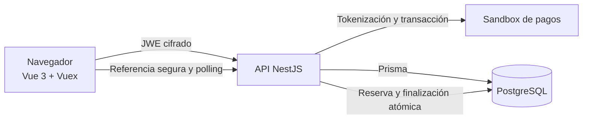
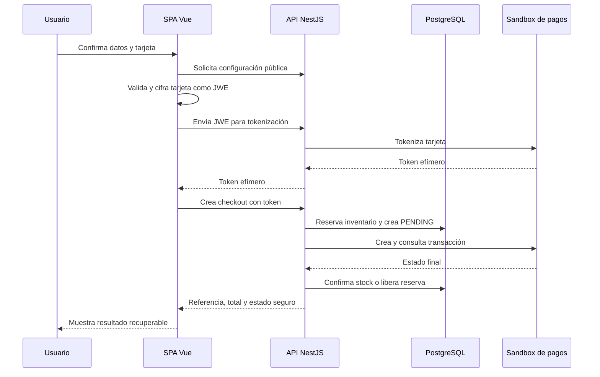
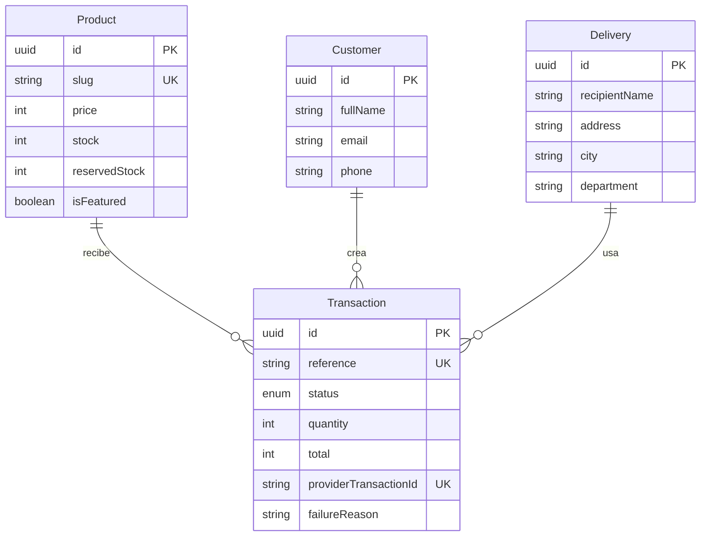

# Checkout Lab

Checkout de un catálogo de cuatro productos construido con Vue 3 + Vuex y NestJS + Prisma +
PostgreSQL. Incluye tokenización cifrada, pagos sandbox, inventario atómico,
recuperación tras refresh, pruebas con umbral obligatorio de cobertura y una
infraestructura reproducible para AWS.

Repositorio canónico:
[`davidGuiitar/checkout-lab`](https://github.com/davidGuiitar/checkout-lab)

## Funcionalidad

El flujo cubre las cinco vistas de la prueba:

1. Catálogo de productos, precios, cantidades e inventario disponible.
2. Datos personales, entrega y tarjeta con validación inmediata.
3. Resumen de producto, tarifa base, envío y total.
4. Procesamiento y recuperación segura de una transacción pendiente.
5. Resultado aprobado, rechazado, anulado o con error.

Solo se persiste el borrador no sensible y la referencia local de la
transacción. PAN, CVC y token de tarjeta no se guardan en `localStorage`,
PostgreSQL ni logs.

## Arquitectura



- `frontend/`: SPA Vue 3, Vue Router, Vuex, Vite, Jest y cifrado JWE.
- `backend/`: NestJS, DTOs, Prisma, Swagger, Jest y adaptador HTTP de pagos.
- `docker-compose.yml`: PostgreSQL y perfil opcional de aplicación completa.
- `infra/terraform/`: VPC, CloudFront/S3, ECR/ECS, ALB, RDS, logs y secretos.
- `postman/`: colección de la API sin credenciales ni datos de tarjeta.

El adaptador de pagos está detrás de un puerto de dominio. La aplicación
almacena importes en pesos COP y convierte a centavos únicamente en el límite
de la pasarela, usando el mismo valor para la firma de integridad.

## Flujo de checkout



## Modelo de datos



La reserva incrementa `reservedStock` por la cantidad solicitada mediante un
`UPDATE` condicional. Solo un pago `APPROVED` descuenta esas unidades de
`stock`; cualquier otro estado libera la reserva. La
actualización condicional del estado evita descontar dos veces al reconsultar.

## Requisitos locales

- Node.js 22 o posterior.
- pnpm 11.
- Docker Desktop con Compose.
- GitHub CLI solo para publicar cambios.

AWS CLI, Terraform y `jq` se requieren únicamente para desplegar.

## Configuración local

1. Crea archivos locales ignorados por Git:

   ```bash
   cp .env.example .env
   cp backend/.env.example backend/.env
   cp frontend/.env.example frontend/.env
   ```

2. En `.env`, define un usuario y contraseña exclusivamente locales para
   PostgreSQL.
3. En `backend/.env`, completa `DATABASE_URL` con esos mismos datos y configura
   las cuatro variables de sandbox de pagos.
4. Nunca pegues ni confirmes llaves, secretos, tokens o datos de tarjeta.

Variables de backend:

| Variable | Uso |
| --- | --- |
| `NODE_ENV` | Entorno de ejecución. |
| `PORT` | Puerto HTTP; por defecto `3000`. |
| `API_PREFIX` | Prefijo opcional; producción usa `api`. |
| `FRONTEND_URL` | Origen único permitido por CORS. |
| `DATABASE_URL` | Conexión PostgreSQL; secreta. |
| `PAYMENT_API_URL` | URL del sandbox; solo backend. |
| `PAYMENT_PUBLIC_KEY` | Llave pública del sandbox. |
| `PAYMENT_PRIVATE_KEY` | Llave privada; secreta. |
| `PAYMENT_INTEGRITY_SECRET` | Secreto para firma; secreto. |

Frontend solo necesita `VITE_API_URL`. Ninguna llave privada se expone en su
bundle.

## Ejecución

Desarrollo con recarga:

```bash
docker compose up -d postgres
pnpm --dir backend install
pnpm --dir frontend install
pnpm --dir backend prisma migrate deploy
pnpm --dir backend prisma db seed
pnpm --dir backend start:dev
pnpm --dir frontend dev
```

Imágenes de producción en Compose:

```bash
docker compose --profile app up --build
```

Servicios locales:

- SPA: `http://localhost:5173`
- API: `http://localhost:3000`
- Swagger: `http://localhost:3000/docs`

## API

| Método | Ruta | Descripción |
| --- | --- | --- |
| `GET` | `/products` | Catálogo, precios e inventario disponible. |
| `GET` | `/products/featured` | Producto, precio e inventario disponible. |
| `GET` | `/checkout/config` | Tarifas, contratos y llave pública de cifrado. |
| `POST` | `/checkout/tokenize` | Recibe únicamente un JWE y devuelve token efímero. |
| `POST` | `/checkout` | Crea cliente, entrega y transacción con token. |
| `GET` | `/transactions/:reference` | Recupera y sincroniza un checkout. |
| `GET` | `/docs` | Swagger UI. |

En AWS las mismas rutas estarán bajo `/api`, incluido `/api/docs`.

La colección importable está en
[`postman/checkout-lab.postman_collection.json`](postman/checkout-lab.postman_collection.json).
Sus variables contienen solo marcadores; no reemplazan el cifrado real que
realiza la SPA.

## Calidad

Validación completa:

```bash
pnpm --dir frontend build
pnpm --dir frontend test:cov --runInBand
pnpm --dir backend build
pnpm --dir backend lint
pnpm --dir backend test:cov --runInBand
pnpm --dir backend test:e2e --runInBand
```

Cobertura global verificada con Jest el 31 de julio de 2026:

| Aplicación | Statements | Branches | Functions | Lines |
| --- | ---: | ---: | ---: | ---: |
| Frontend | 90,80% | 85,78% | 90,09% | 93,41% |
| Backend | 98,94% | 91,93% | 97,61% | 98,79% |

Ambas configuraciones imponen 80% global en statements, branches, functions y
lines. Las E2E usan PostgreSQL real y cubren aprobado, rechazado, error de red,
sin stock, refresh, concurrencia, validación, CORS, headers y rate limiting.

## Seguridad

- JWE `RSA-OAEP-256` + `A256GCM` antes de salir del navegador.
- Backend recibe el JWE, pero nunca PAN ni CVC en claro.
- Llave privada y secreto de integridad existen solo en backend/Secrets Manager.
- DTOs con whitelist, rechazo de campos extra y límites de longitud.
- Helmet, CORS de origen único y throttling global.
- Errores externos traducidos a mensajes estables sin detalles internos.
- Logs de pasarela limitados a código HTTP, tipo y nombres de campos inválidos.
- RDS cifrado y privado; ECS en subred privada; S3 sin acceso público.
- CloudFront termina HTTPS y aplica CSP/HSTS al frontend.
- Secretos de producción fuera del estado Terraform y fuera de Git.

## Despliegue AWS

La guía operativa está en [`infra/README.md`](infra/README.md). La configuración
Terraform pasó `fmt -check` y `validate`, y ambas imágenes Docker compilan y
arrancan correctamente en Compose.

Estado actual:

| Elemento | Estado |
| --- | --- |
| Terraform y scripts | Preparados y validados |
| Imágenes locales | Construidas y verificadas |
| Recursos AWS | Pendientes de aprobación explícita de costos |
| URL CloudFront | Pendiente de `terraform apply` |

No se ejecutó ningún recurso con costo ni se inventó una URL de producción.
